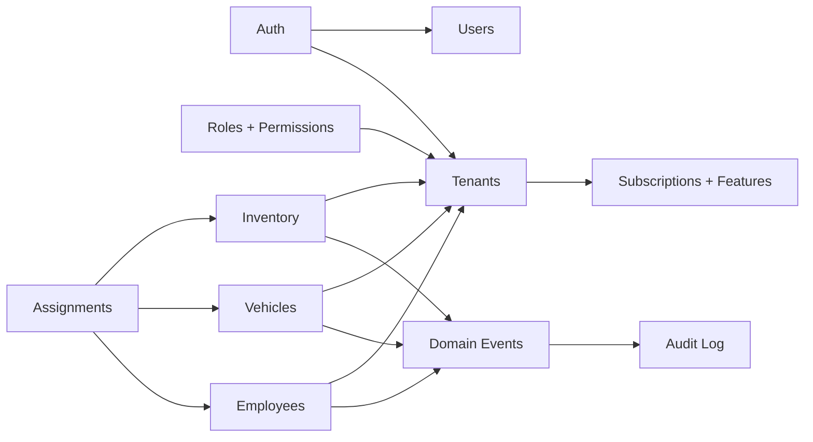

# Architecture Overview

## 1. Architecture overview

Fleger Warehouse egy modular monolith SaaS foundation. Az MVP egyetlen NestJS backendből, egy Angular frontendből és egy shared MongoDB adatbázisból áll.

Az üzleti modulok domain boundary szerint különülnek el:

- identity: auth, users, memberships
- tenant management: tenants, settings, features, plans
- inventory: items, categories, assignments, transactions
- fleet: vehicles, vehicle assignments
- workforce: employees
- governance: roles, permissions, audit log, platform admin

Későbbi microservice bontás esetén ezek a boundary-k természetes service határokká válhatnak.

## 2. Domain model

Tenant:

- `name`, `slug`, `status`, `planCode`, `settings`, `branding`

User:

- `email`, `passwordHash`, `globalStatus`

TenantMembership:

- `userId`, `tenantId`, `roleId`, `status`, `joinedAt`

Role:

- `tenantId`, `name`, `permissions`, `systemRole`

Tenant-scoped business entities:

- `Employee`
- `Vehicle`
- `InventoryItem`
- `Assignment`
- `VehicleAssignment`
- `InventoryTransaction`
- `AuditLog`
- `TenantFeature`

## 3. Tenant isolation strategy

The backend never trusts a `tenantId` supplied by the frontend.

The active tenant is resolved from:

- authenticated user id
- selected workspace header, for example `X-Tenant-Slug`
- verified active tenant membership

The request-scoped `TenantContext` is then injected into services and repositories. Tenant-owned reads and writes require a tenant context and apply `tenantId` centrally.

IDOR protection rule:

- `GET /employees/:id` must query by both `_id` and `tenantId`
- update/delete operations must do the same
- tenant admins are still tenant-scoped and cannot operate across tenant boundaries

Platform admins use separate platform-admin routes and explicit service methods.

## 4. MongoDB schema plan

Initial database strategy:

- shared database
- shared collections
- required `tenantId` on all tenant-specific documents

Indexes:

- `inventory_items`: `{ tenantId: 1, inventoryNumber: 1 }` unique
- `employees`: `{ tenantId: 1, employeeNumber: 1 }` unique
- `vehicles`: `{ tenantId: 1, licensePlate: 1 }` unique
- `assignments`: `{ tenantId: 1, itemId: 1, status: 1 }`
- `vehicle_assignments`: `{ tenantId: 1, vehicleId: 1, status: 1 }`
- `audit_logs`: `{ tenantId: 1, timestamp: -1 }`

No tenant-local business identifier should be globally unique.

## 5. Module dependency diagram

## 6. API design

All APIs are versioned under `/api/v1`.

Core endpoints:

- `POST /auth/login`
- `POST /auth/refresh`
- `GET /auth/me`
- `GET /tenants/workspaces`
- `GET /dashboard`
- `GET|POST /employees`
- `GET|PATCH /employees/:id`
- `GET|POST /inventory/items`
- `POST /assignments/inventory`
- `POST /assignments/inventory/:id/return`
- `GET|POST /vehicles`
- `POST /assignments/vehicles`
- `POST /assignments/vehicles/:id/return`
- `GET /audit-log`
- `GET|PATCH /settings`
- `GET|POST /platform-admin/tenants`

## 7. Frontend feature architecture

Angular structure:

- `core/auth`: token handling, guards
- `core/tenant`: workspace state, tenant switcher, tenant-aware cache reset
- `core/api`: HTTP client wrappers and interceptors
- `shared/ui`: reusable controls
- `features/*`: route-level business features
- `layouts`: SaaS shell with sidebar and top bar

The active workspace is represented as a signal and sent with API requests. On tenant switch, feature state is reset.

## 8. RBAC and permission plan

Roles are tenant-specific documents. Permissions are stable string capabilities.

Examples:

- `inventory.read`
- `inventory.create`
- `inventory.update`
- `inventory.assign`
- `employee.read`
- `employee.create`
- `employee.disable`
- `vehicle.assign`
- `role.manage`
- `settings.manage`

Platform-level authorization is separate from tenant RBAC.

## 9. SaaS feature and plan architecture

Plans define features and limits:

- `STARTER`
- `PRO`
- `ENTERPRISE`

Tenant features can override staged rollouts:

- `inventoryManagement`
- `vehicleManagement`
- `auditLogs`
- `advancedRoles`

Backend services enforce limits. Frontend hiding is treated as convenience only.

## 10. Roadmap

See `docs/implementation-roadmap.md`.
